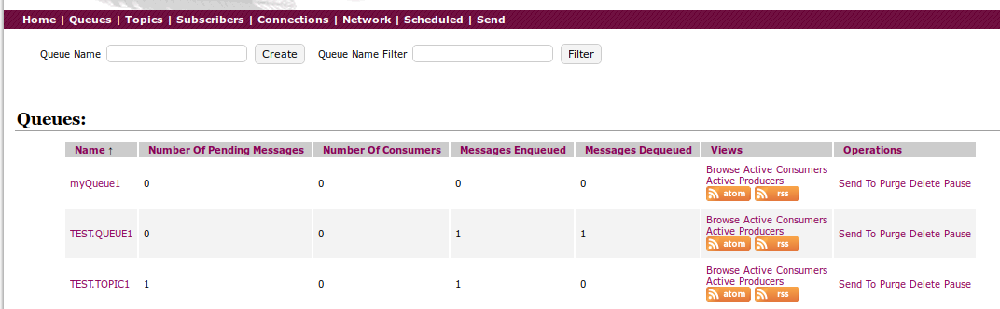
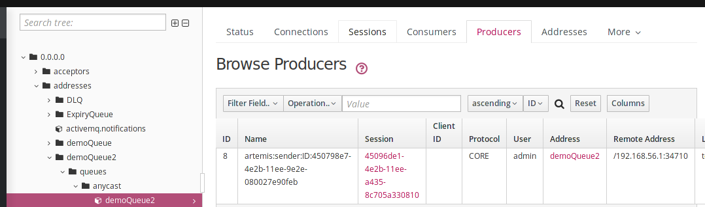

ActiveMQ is a message brocker for exchanging messages between applications.  


**ActiveMQ**
----------------------------------
v5.

**Queue**
Once a Message is received by a consumer, it is removed from the FIFO Queue.  

**Topic**  
Messages sent to a Topic will be delivered to actively(only) listening subscribers.

**Start/Stop**

	$ bin/activemq start
	$ bin/activemq stop

**Logs**
> data/activemq.log

**Configuration File**  
> conf/**activemq.xml**

**Web Console**
> http://192.168.56.103:8161/admin   user/pass:admin/admin




**Remote Access**   
Change the IP for the Web Console: **jetty.xml**

	```xml
	<bean id="jettyPort" class="org.apache.activemq.web.WebConsolePort" init-method="start">
    	    <property name="host" value="192.168.56.103"/>
	```

**ActiveMQ Examples**   
https://activemq.apache.org/examples

**Java Example of Producer/Consumer**    
https://github.com/magos3/magOS/tree/master/workspace/activemq

**ActiveMQ Artemis**
-----------------------------------
Artemis will be the ActiveMQ successor.  
Environment: Apache Artemis 2.30


### Create ActiveMQ Artemis instance

 	$ ./artemis create --http-host 192.168.56.103 /opt/activemq-artemis/myBroker

### Help

	$ ./artemis --help
	$ ./artemis help create

### Start the Brocker

	$ /opt/activemq-artemis/myBroker/bin/artemis run

### Artemis Console 

	http://192.168.56.103:8161/console

### Send Messages

	$ ./artemis producer --destination demoQueue3  --message-count 10 --url tcp://192.168.56.103:61616  --user admin --password admin


Producers



### Examples of JMS Client:

	$ cd INSTALL_DIR/examples/features/standard/queue
	$ mvn install


mvn verify -PnoServer

How To run Artemis Examples:

	https://activemq.apache.org/components/artemis/documentation/latest/examples.html


