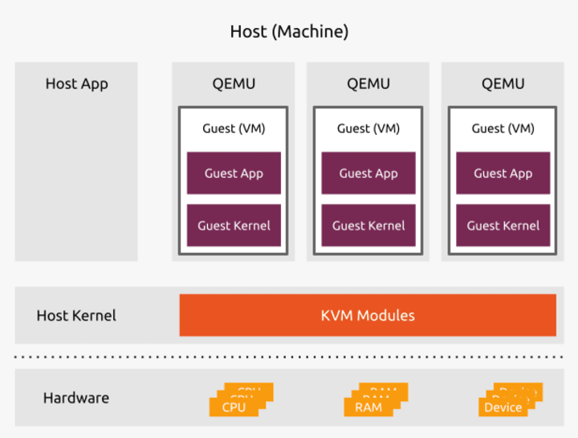

- Host: ubuntu 22.04
- Guest: centos 7

Installation of KVM

	sudo apt-get install qemu-kvm libvirt-daemon-system libvirt-clients bridge-utils

Check virtualisation

	$ kvm-ok

	INFO: /dev/kvm exists
	KVM acceleration can be used

Adding your username to libvirtd group

	$ sudo adduser `id -un` kvm
	$ sudo adduser `id -un` libvirt

Verify Installation

	$ sudo virsh list --all

Install virt-manager GUI

	sudo apt-get install virt-manager

Creating VMs

	$ virt-install \
 		--network bridge:br0 \
 		--name vm1 \
 		--ram=1024 \
 		--vcpus=1 \
 		--disk path=./vm-images/vm1.img,size=10 \
 		--graphics none \
 		--location=/home/jadmin/Downloads/lubuntu-18.04.5-desktop-i386.iso \
 		--extra-args="console=tty0 console=ttyS0,115200"