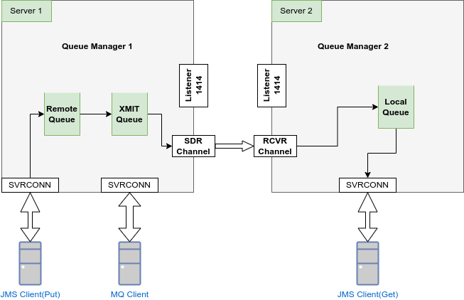
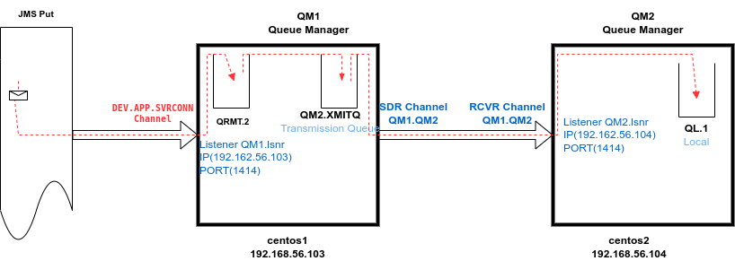

**Table Of Contents**
- [QuickStart](#quickstart)
	- [History](#history)
	- [Installing IBM MQ](#installing-ibm-mq)
- [Configuration](#configuration)
	- [Queue Manager](#queue-manager)
	- [Channels](#channels)
	- [Listeners](#listeners)
	- [Authentication](#authentication)
	- [Authorization](#authorization)
	- [Active/Passive multi-instances](#activepassive-multi-instances)
	- [Commands](#commands)
	- [Logs](#logs)
- [MQSC : MQ Script Commands](#mqsc--mq-script-commands)
- [MQ Explorer](#mq-explorer)
- [Use cases](#use-cases)
	* [Single way communication between two QMs](#single-way-communication-between-two-qms)
- [Resolved Errors](#resolved-errors)
- [Websphere MQ](#websphere-mq)
- [Docs](#docs)

**QuickStart**
------------------------
Environment : IBM MQ 9.3, Centos 7.4

### History
- 2014: IBM MQ 
- 2002: Websphere MQ
- 1993: MQ Series

### Installing IBM MQ 
1. Creating user/group
	
		$ groupadd mqm
    	$ useradd -g mqm -m -d /opt/mqm mqm

2. Prepare the FS  
must be done properly for a production installation. See the manual.

3. Unzip the file

		$ tar xvf 9.3.0.0-IBM-MQTRIAL-LinuxX64.tar.gz
	
4. Accept Licence

		$ cd  MQServer
		$ ./mqlicense.sh

5. Installing the IBM MQ
		
		$ rpm -Uvh MQSeries*.rpm

**Configuration**
--------------------------------

### Queue Manager
It is the Runtime that provides a logical container for message queue. It is also responsible for tranfering data to other queue managers using Channels.

**Create a Queue Manager**

	$ su - mqm
	$ crtmqm DEV.QM1

Create a QM with options:

	$ crtmqm -ld /path/to/logs -md /path/to/qmgrs DEV.QM1

Some Options for crtmqm:   
* -md : data files Directory, by default '/var/mqm/qmgrs'
* -ld : directory for data log files.
* -p : port. Default 1414
* -u : dead letter queue, for undeliverable messages. Dafault SYSTEM.DEAD.LETTER.QUEUE

Let's take a look at  /var/mqm/**mqs.ini**:

		QueueManager:
		   Name=DEV.QM1
		   Prefix=/var/mqm
		   Directory=DEV.QM1
		   InstallationName=Installation1

**Start the QM**

	$ strmqm DEV.QM1

**Dispaly the Status of the QM** 
	
	$ dspmq -m DEV.QM1
		QMNAME(DEV.QM1)        STATUS(Running)

**Stop the QM**    	 

	$ endmqm DEV.QM1

### Channels
Channels are a communication link, used to connect Client to queue manager , or QM to QM.

There are two types of channels
1. **Message Channels**: 
	- link between two queue managers using MCA(Message Channel Agent). 
	- Both channels at the two QMs should have the __same name__

	- TCP/IP is widely used.

	Subtypes of the Message Channels:  
		
	1.1 **Sender -Receiver channel**  
	1.2 **Server - Requester channel**: Used to send messages from one QM to other QM.   
	
	Server:

		DEFINE CHANNEL ('channel.name') CHLTYPE(SVR) DESCR('description') TRPTYPE(TCP) XMITQ(xmitq.name) CONNAME('hostname(portno)')
	
	Requester:

		DEFINE CHANNEL ('channel.name1') CHLTYPE(RQSTR) DESCR('description') CONNAME('hostname(portno)')

	1.3 **Cluster sender - Receiver channel**  

2. **MQI Channels**: used to connect a IBM MQ Client to a Queue manager or IBM MQ Server.

	Server:

		DEFINE CHANNEL ('channel.name') CHLTYPE(SVRCONN) DESCR('description')

	Client:

		DEFINE CHANNEL ('channel.name') CHLTYPE(CLNTCONN) CONNAME('hostname(portno)') TRPTYPE(TCP) DESCR('description')

### Listeners

Create a Listener

    $ runmqsc DEV.QM1
    
    	DEFINE LISTENER(DEV.QM1.lsnr) TRPTYPE(tcp) PORT(1414) IPADDR(192.168.56.103)
		DEFINE LISTENER(QM1.lsnr) TRPTYPE(tcp) PORT(1414) IPADDR(192.168.56.103)
	
		DISPLAY LISTENER(*)

Start a Listener:

	START LISTENER(DEV.QM1.lsnr)

Check the listener

    $ ps -ef | grep runmqlsr
    mqm       3135  2643 /opt/mqm/bin/runmqlsr -r -m DEV.QM1 -t TCP -p 1414 
    
To delete a listener  

    DELETE LISTENER(DEV.QM1.lsnr)

Stop/Start Listener

- via runmqsc: 

		START LISTENER(DEV.QM1.lsnr)

- Via shell:

		runmqlsr -m DEV.QM1 -t TCP -p 1414
    	endmqlsr -m DEV.QM1

Same listener can service multiple queue managers,

### Queues

Queue Types:
- **Local Queue**: A queue is known to a program as local if it is owned by the queue manager to which the program is connected. 
- **Remote Queue**: To a program, a queue is remote if it is owned by a different queue manager to the one to which the program is connected.

### Authentication
There are 2 auth types(AUTHTYPE attribute):

- **IDPWOS**: the queue manager uses the local operating system to authenticate the user ID and password.
- **IDPWLDAP**: the queue manager uses an LDAP server to authenticate the user ID and password. 

1. Enable authentication by **IDPWOS** on the QM:

	 	$ runmqsc DEV.QM1
	and
	
		DISPLAY qmgr CONNAUTH

		DISPLAY CHLAUTH(*)
   

		ALTER QMGR CONNAUTH(DEV.DEFAULT.AUTHINFO.IDPWOS)
	    
		DEFINE AUTHINFO(DEV.DEFAULT.AUTHINFO.IDPWOS) AUTHTYPE(IDPWOS) FAILDLAY(10) CHCKLOCL(OPTIONAL) CHCKCLNT(REQUIRED)

		REFRESH SECURITY TYPE(CONNAUTH)

2. Create an OS User ID and grant it to access the QM  

		$ useradd m.adam -g mqm 
		$ setmqaut -m DEV.QM1 -n DEV.QUEUE1 -t queue -p  m.adam +all
		$ setmqaut -m DEV.QM1 -t qmgr -p  m.adam +all

3. Grant all users of mqm group to access to Q1 queue

		$ setmqaut -m DEV.QM1 -n Q1 -t q -g mqm +connect +get +put +browse +inq 

4. Refresh security

		$ runmqsc DEV.QM1  
			
		REFRESH SECURITY TYPE(CONNAUTH)

**Dump authorisation**

	$ dmpmqaut -m DEV.QM1                        ;dump all 
	$ dmpmqaut -m DEV.QM1 -n MYAPP.JMS.SVRCONN   ;dump a profile(ie channel) auth
	

### Authorization
https://webspheremqadministrator.blogspot.fr/2014/06/how-to-configure-websphere-mq.html
    
    $ setmqaut -m DEV.QM1 -n a.* -t queue -p anass +all
    
And refresh the Security:

    runmqsc:
		REFRESH SECURITY TYPE(CONNAUTH)

    	DISPLAY CHLAUTH(*)
    

### Active/Passive multi-instances
See [this technote](https://www.ibm.com/support/pages/node/6985543) 

### Files

    **qm.ini** : /var/mqm/qmgrs/DEV.QM1/qm.ini
    
	/var/mqm: 	gestionnaire et files
    

### Logs

Windows: 

		C:\Program Files\IBM\WebSphere MQ\log\qmgr

UNIX: 
		
		/var/mqm/log/
     	/var/mqm/errors/AMQERR01.LOG

### Commands

	$ dspmqver				; display the version of MQ
	$ dspmq					; check status of queue managers
	$ endmqm -i DEV.QM1	; shutdown immediate of qm

**MQSC** : MQ Script Commands
-----------------------------------
The tool **runmqsc** runs scripts on the queue manager.

Example of Create a Local queue:

1. Start the script tool (su - mqm)

		$ runmqsc DEV.QM1

2. Create the a local queue LQ1

		DEFINE QLOCAL(LQ1)

3. End

		END

**Syntax of MQSC Commands**   

	Command OBJECT(name) PARAM1(value1) PARAM2(value2) ...

	Commands: ALTER, CLEAR, DEFINE, DELETE, DISPLAY, END, ...
	Objects : AUTHINFO QREMOTE CHANNEL QUEUE  CONN PROCESS SERVICE  LISTENER, QALIAS, ...

Examples of MQSC

	DISPLAY CHANNEL(*) ALL  --> Diplay all columns of all channel      
	DISPLAY CHANNEL(*) CHLTYPE TRPTYPE --> display only columns name, chltype and trptype

**MQ Explorer**
------------------------------------
Env: Ubuntu 20.04 

### Installating MQ Explorer

	$ tar xvf ....tar.gz
	$ ./Setup.bin ( as root)

### Connect MQ Exlorer to a remote Queue Manager

See this [technote](https://www.ibm.com/support/pages/how-setmqaut-commands-allow-mq-explorer-remote-administration-mq-queue-manager-unix
)
1. The [Queue Manager](#queue-manager) must be running

1. Create a new Server Channel  

		DEFINE CHANNEL(DEV.ADMIN.SVRCONN) CHLTYPE(SVRCONN)

2. Listener must be UP  
	see : [Listeners](#listeners)

3. Set CHLAUTH  
	See this [thechnote](https://www.ibm.com/support/pages/mq-rc-2035-mqrcnotauthorized-or-amq4036-or-jmswmq2013-when-using-client-connection-mq-administrator-chlauth-channel-authentication-records)
	and [this](https://www.ibm.com/docs/en/ibm-mq/9.2?topic=issues-creating-new-chlauth-rules-users)

		SET CHLAUTH(DEV.ADMIN.SVRCONN) TYPE(BLOCKUSER) USERLIST('nobody')
		SET CHLAUTH(DEV.ADMIN.SVRCONN) TYPE(ADDRESSMAP) ADDRESS(*) ACTION(REMOVE)

	- Add an entry for the client(ipaddr) that needs access.
		
		SET CHLAUTH(DEV.ADMIN.SVRCONN) TYPE(ADDRESSMAP) ADDRESS(192.168.56.1) USERSRC(CHANNEL)

4. Enable Authentication by user/passwd 

   There are several options:    

   4.1 To Grant to the userID  full privileges to all QM objects, add the userID to the **mqm** group  
		
		$ useradd -g mqm mqadmin

	❗ userid (eg mqadmin) must belong to **mqm** group. 
	
	And define AUTHINFO Object:
	
	    runmqsc:   
			ALTER QMGR CONNAUTH(DEV.DEFAULT.AUTHINFO.IDPWOS)
	    
			DEFINE AUTHINFO(DEV.DEFAULT.AUTHINFO.IDPWOS) AUTHTYPE(IDPWOS) FAILDLAY(10) CHCKLOCL(OPTIONAL) CHCKCLNT(REQUIRED)
		
			REFRESH SECURITY TYPE(CONNAUTH)

**Use cases**
----------------------------------
http://webspherepundit.com/websphere-mq

### Single way communication between two QMs

**QM1 to QM2** : Messages are sent by a JMS application to QM1 wich transmit them to a remote queue manager QM2. In this scenario, there is no communication in the direction from QM2 to QM1.

Environment: IBM MQ 9.3, Centos 7.

**Remote QM2**:

- Create QM, Local Queue, Listener

		$ crtmqm QM2
		$ strmqm QM2
		$ runmqsc QM2
			DEFINE QLOCAL(QL.1)
			
			DEFINE LISTENER(QM2.LISTENER) TRPTYPE(TCP) PORT(1414) IPADDR(192.168.56.104)
			START LISTENER(QM2.LISTENER)

	Listener can be started with :

		$runmqlsr -r -m QM2 -t TCP -p 1414 -i 192.168.56.104

- Receiver Channel

		DEFINE CHL(QM1.QM2) CHLTYPE(RCVR) REPLACE TRPTYPE(TCP)
		START CHANNEL(QM1.QM2)
		DISPLAY LSSTATUS (QM2.LISTENER)
		DISPLAY CHSTATUS(QM1.QM2)

		$ ps -ef | grep runmqlsr

- Authentication by userid/password : so QM1 can transmit message on QM2/QL.1

			$ useradd adam  // password changeit
			$ setmqaut -m QM2 -n QL.1 -t queue -p adam +all
			$ setmqaut -m QM2 -t qmgr -p adam +all

			ALTER QMGR CONNAUTH(DEV.AUTHINFO.IDPWOS)
			DEFINE AUTHINFO(DEV.AUTHINFO.IDPWOS) AUTHTYPE(IDPWOS) FAILDLAY(10) CHCKLOCL(OPTIONAL) CHCKCLNT(REQUIRED)
			REFRESH SECURITY TYPE(CONNAUTH)

	❗ userid (e.g adam) should NOT belong to **mqm** group. Else the connexion will be rejected.

**Source QM1**:
- Create QM

		$ crtmqm QM1
		$ strmqm QM1

- Create Transmission Queue:

		DEFINE QLOCAL(QM2.XMITQ) REPLACE USAGE(XMITQ)

- Create the Sender Channel QM1.QM2  with these details
	- CONNAME ( Use the Ip address of the Destination QMgr and the port of the Dest Listener)
	- XMITQ ( Use the Transmission Queue for the senders channel )

	NOTE : The Sender and Receive channels should have the same name.

		DEFINE CHANNEL(QM1.QM2) CHLTYPE(SDR) REPLACE TRPTYPE(TCP) CONNAME('192.168.56.104(1414)') XMITQ(QM2.XMITQ) USERID('adam') PASSWORD('changeit')

- Define the Remote Queue

		DEFINE QREMOTE(QRMT.2) RNAME(QL.1) RQMNAME(QM2) XMITQ(QM2.XMITQ)

- Start the Sender Channel QM1.QM2

		START CHANNEL(QM1.QM2)

		display chstatus(QM1.QM2)

- Listener (Optional)

		DEFINE LISTENER(QM1.LISTENER) TRPTYPE(TCP) PORT(1414) IPADDR(192.168.56.103)
		START LISTENER(QM1.LISTENER)

- Authentication by userid/password to put message on QM1/QRMT.2 queue:
			
			$ useradd m.ali // passwd changeit
			$ setmqaut -m QM1 -n QRMT.2 -t queue -p m.ali +all
			$ setmqaut -m QM1 -t qmgr -p m.ali +all

			DEFINE CHANNEL (DEV.APP.SVRCONN) CHLTYPE(SVRCONN) DESCR('description')
			
			ALTER QMGR CONNAUTH(DEV.AUTHINFO.IDPWOS)
			DEFINE AUTHINFO(DEV.AUTHINFO.IDPWOS) AUTHTYPE(IDPWOS) FAILDLAY(10) CHCKLOCL(OPTIONAL) CHCKCLNT(REQUIRED)

			REFRESH SECURITY TYPE(CONNAUTH)

	❗ userid (e.g m.ali) should NOT belong to **mqm** group. Else the connexion will be rejected.

			
- [Enable Explorer MQ on MQ1 and MQ2](#connect-mq-exlorer-to-a-remote-queue-manager)

**Programming Clients**
----------------------------------
- Clients

	There are two Client programming models: 

	- MQI (MQCONN  MQCONNX MQOPEN  MQCLOSE MQPUT   MQGET...)

	- JMS (for non-Java languages use XMS)

	Each remotely connected client will have a SVRCONN channel running on its behalf. It is possible to have many thousands of these channels running into a single Queue Manager.

	The client must be able to identify which channel it should use to communicate with the queue manager.

See JMS Example : https://github.com/magos3/magOS/tree/master/workspace/activemq 

	
**Docs**
--------------------------
- Blog : https://www.freekb.net/Articles?tag=IBM%20MQ
- Use cases: http://webspherepundit.com/distributed-mq-channel-setup-single-way-communication

- https://webspheremqadministrator.blogspot.fr/2014/06/how-to-configure-websphere-mq.html

